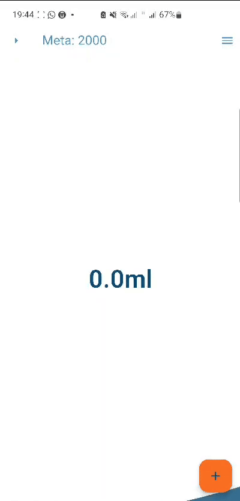
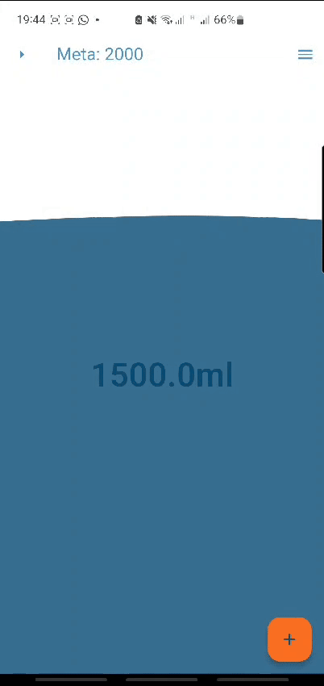
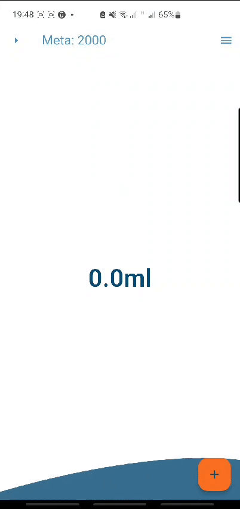
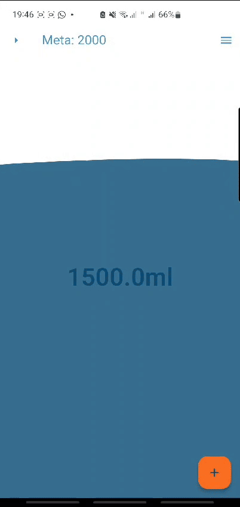

# N1 - Desenvolvimento Mobile 📱

Projeto desenvolvido para conteplar a primeira nota da matéria de Desenvolvimento Mobile.

Este aplicativo busca controlar a quantidade de água bebida no dia, permitindo que o usuário
crie metas e verifique a quantidade de água tomada todos os dias.

## Principais funcionalidades

- Adicionar quantidade de água



- Zerar quantidade do dia



- Setar meta diária



- Verificar histórico de registros



## Paleta de cores utilizada


## Como instalar

- Clone o repositório e entre no diretório raiz

```consle
git clone https://github.com/PedrelliMath/n1-dev-mobile.git & cd n1-dev-mobile
```

## Como rodar

Versão do **Flutter** e **Dart**
`Flutter 3.24.0 • channel stable • https://github.com/flutter/flutter.git
Framework • revision 80c2e84975
Engine • revision b8800d88be
Tools • Dart 3.5.0 • DevTools 2.37.2`

- Inicialize seu emulador ou utilize a versão web

- Utilizando o emulador:

```console
emulator -avd {virtual_device_name}
```

- Execute o comando flutter devices e selecione o emulador

```console
flutter devices
```

- Se o emulador estiver rodando, selecione Android SDK.
  Ou selecione a versão web.

- Execute o comando flutter run

```console
flutter run
```

- Para gerar o Apk

```console
flutter build apk
```
